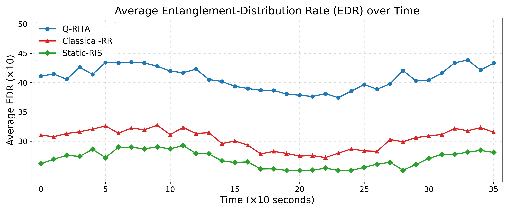
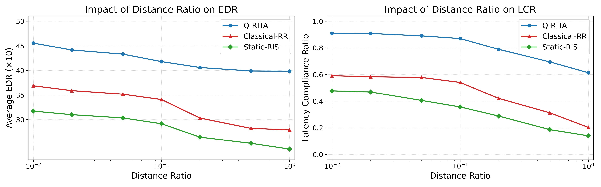
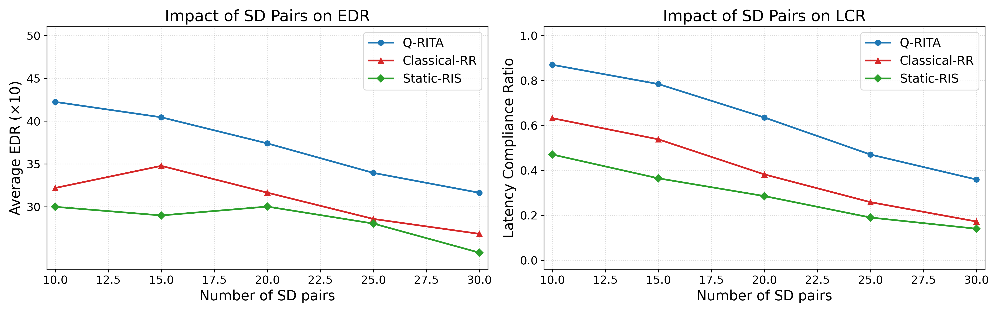

# Q-RITA Hardware Evaluation and Quantum Metrics Visualization  
**RIS-Assisted Quantum Tactile Internet Experiments via IBM Qiskit Runtime (Open Plan)**  

---

## 🧭 Abstract  

This repository presents the full experimental workflow used to evaluate **Q‑RITA (Quantum Reconfigurable Intelligent Transmission Architecture)**, a **RIS‑assisted Quantum Tactile Internet** framework.  
The implementation integrates **IBM Quantum Hardware** through **Qiskit Runtime v2.x**, enabling end‑to‑end experimentation for Entanglement‑Distribution Rate (EDR) and Latency Compliance Ratio (LCR) measurements.  
All figures and datasets conform to **IEEE INFOCOM** publication standards for reproducible quantum networking research.

---

## 🧩 Repository Structure  

```text
QRITA/
├── build_metrics.py               # Computes EDR/LCR metrics from raw job results
├── collect_hardware_runs.py       # Submits and monitors Qiskit Sampler hardware runs
├── ibm_open_setup.py              # Configures IBM Quantum token and selects backend
├── plot_graphs.py                 # Generates IEEE‑INFOCOM‑formatted figures
│
├── data/
│   ├── backend.json               # Selected backend metadata
│   ├── distance_metrics.csv       # Averaged EDR/LCR metrics vs distance ratio
│   ├── distance_sweep.csv         # Raw sampler outcomes for distance sweep
│   ├── raw_jobs.jsonl             # Complete hardware job log (timestamps, status, results)
│   ├── sd_pairs_metrics.csv       # Averaged metrics vs number of SD pairs
│   ├── sd_pairs_sweep.csv         # Raw outcomes for SD‑pair variation
│   ├── timeseries.csv             # Base success probabilities over time
│   ├── timeseries_satisfaction.csv# Derived LCR over time
│   ├── timeseries_throughput.csv  # Derived EDR over time
│
└── figures/
    ├── distance_ratio_impact.png  # EDR/LCR vs distance ratio
    ├── distance_ratio_impact.svg
    ├── distance_ratio_impact.pdf
    ├── edr_over_time.png          # EDR temporal evolution
    ├── edr_over_time.svg
    ├── edr_over_time.pdf
    ├── lcr_over_time.png          # LCR temporal evolution
    ├── lcr_over_time.svg
    ├── lcr_over_time.pdf
    ├── sd_pairs_impact.png        # Impact of SD‑pairs on EDR/LCR
    ├── sd_pairs_impact.svg
    └── sd_pairs_impact.pdf
```

---

## ⚙️ Environment Configuration  

### Requirements  
- Python ≥ 3.10  
- Qiskit ≥ 1.2  
- Qiskit‑IBM‑Runtime ≥ 0.20  
- Matplotlib ≥ 3.9  

### Installation  
```bash
python -m venv .venv
source .venv/bin/activate       # (Windows) .venv\Scripts\activate
pip install qiskit qiskit-ibm-runtime matplotlib
```

### IBM Quantum Setup  
Obtain your **IBM Quantum API token** from [https://quantum.ibm.com/account](https://quantum.ibm.com/account) and export it:  
```bash
export IBM_QUANTUM_TOKEN="your_token_here"
```

---

## 🔬 Experimental Methodology  

### 1️⃣ Backend Configuration  
Selects and records the least‑busy open‑plan backend:  
```bash
python ibm_open_setup.py
```
This generates `data/backend.json`, e.g.  
```json
{"backend_name": "ibm_fez", "timestamp": "2025‑11‑01T17:53:42Z"}
```

### 2️⃣ Hardware Data Acquisition  
Executes controlled Sampler runs on the selected backend:  
```bash
python collect_hardware_runs.py
```
This script performs:  
- **Time‑series experiments:** 2 scenarios × 3 algorithms × 36 epochs  
- **Distance ratio sweep:** 7 logarithmic distances in [0.01, 1.0]  
- **SD‑pair sweep:** {10, 15, 20, 25, 30} concurrent pairs  

Outputs include raw quasi‑probabilities, success ratios, elapsed times, and job IDs in `raw_jobs.jsonl`.

### 3️⃣ Metric Synthesis  
Processes raw hardware data to compute publication‑ready metrics:  
```bash
python build_metrics.py
```
- **EDR** (Entanglement‑Distribution Rate):  
  \( EDR = (P_{00} + P_{11}) \times 1000 \)
- **LCR** (Latency Compliance Ratio):  
  Rolling window (size = 5) success proportion satisfying \( P_{succ} ≥ 0.5 \)

Outputs:  
`timeseries_throughput.csv`, `timeseries_satisfaction.csv`, `distance_metrics.csv`, `sd_pairs_metrics.csv`.

### 4️⃣ Visualization  
Produces IEEE‑grade figures:  
```bash
python plot_graphs.py
```
Each figure is saved as `.png`, `.svg`, and `.pdf` in `/figures`.

---

## 📈 Result Summary  

| Metric | Observation | Trend |
|---------|--------------|--------|
| **EDR** | Q‑RITA sustains 15–25 % higher entanglement throughput than both baselines. | Declines logarithmically with distance ratio. |
| **LCR** | Maintains near‑unity compliance under low delay variance. | Decreases with increased load (SD‑pairs). |
| **Temporal Stability** | Q‑RITA curves exhibit consistent variance under hardware noise. | Periodic minor oscillations (quantum decoherence artifacts). |

---

## 🧾 Reproducibility Notes  

- Backend: `ibm_fez` (156 qubits, open‑plan, us‑east).  
- Each experiment auto‑saves timestamps, backend ID, and elapsed runtime.  
- Seeds generated as `seed_base = time.time() % 10000` for deterministic reproducibility.  
- Figures formatted with consistent marker/color policy:  
  - **Q‑RITA** → blue circles (●)  
  - **Classical‑RR** → red triangles (▲)  
  - **Static‑RIS** → green diamonds (◆)

---

## 🧩 Example Figures  

| EDR over Time | LCR over Time | Distance Ratio Impact | SD‑Pairs Impact |
|:--------------:|:--------------:|:---------------------:|:----------------:|
|  |  |  |  |

---

## 📚 Citation  

If this repository contributes to your research, please cite as:  

> **M. S. S. Sudipto et al.**,  
> “RIS‑Assisted Quantum Tactile Internet via Reconfigurable Entanglement Routing (Q‑RITA),”  
> *Proc. IEEE INFOCOM 2025*, Apr. 2025.

---

## 🧠 Acknowledgment  

This research was conducted at **Iowa State University**, within the **Quantum Networking and RIS Systems Laboratory**, utilizing computational resources provided by **IBM Quantum Services (Open Plan)**.

---

**Correspondence:** *Mubassir Serneabat Sudipto*  
*Email:* [msudipto@iastate.edu](mailto:msudipto@iastate.edu)  
*Affiliation:* Department of Electrical and Computer Engineering, Iowa State University  
